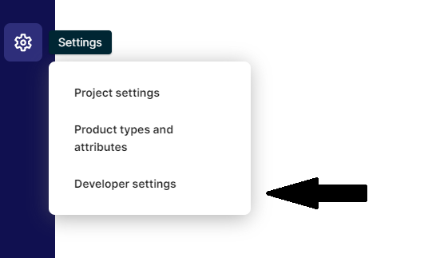
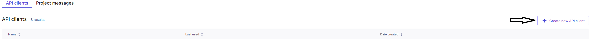
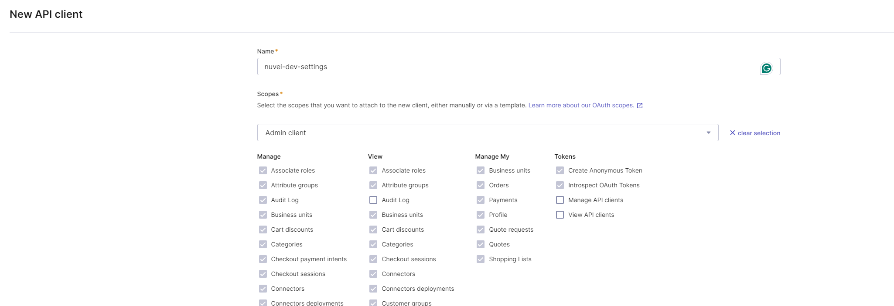
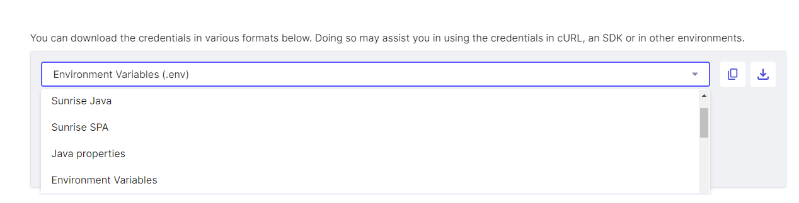

# How to run

- [How to run](#how-to-run)
  - [Environment variables](#environment-variables)
    - [Required environment variables](#required-environment-variables)
    - [Preparing the credentials](#preparing-the-credentials)
  - [Running](#running)
    - [Locally](#locally)
    - [Docker, Kubernetes, Google Cloud Functions](#docker-kubernetes-google-cloud-functions)

## Environment variables

The DMN module requires the following variables to start:

```console
DMN_API_PORT=

CTP_PROJECT_KEY=
CTP_CLIENT_SECRET=
CTP_CLIENT_ID=
CTP_AUTH_URL=
CTP_API_URL=

NUVEI_SECRET_KEY=
```

There are 3 groups of environment variables as described below:

- `nuvei` attribute group
- `commercetools` attribute group
- `other` attribute group

### Required environment variables

| Group           | Name                         | Content                                                            |
| --------------- | ---------------------------- | ------------------------------------------------------------------ |
| `nuvei`         | `NUVEI_SECRET_KEY`           | Provided by Nuvei, used by the service to calculate the checksum. Check the [Authenticating a DMN Checksum](#https://docs.nuvei.com/documentation/integration/webhooks/payment-transaction-requests/#Authenticating_a_DMN_Checksum) guide for more details. |
| `commercetools` | `CTP_PROJECT_KEY`            | The project key in commercetools                                   |
| `commercetools` | `CTP_CLIENT_SECRET`          | OAuth 2.0 `client_secret` and can be used to obtain a token.       |
| `commercetools` | `CTP_CLIENT_ID`              | OAuth 2.0 `client_id` and can be used to obtain a token.           |
| `commercetools` | `CTP_AUTH_URL`               | The commercetools OAuth 2.0 service is hosted at that URL.         |
| `commercetools` | `CTP_API_URL`                | The commercetools HTTP API is hosted at that URL.                  |s
| `other`         | `DMN_API_PORT`               | The port number on which the application will run.                 |

> **_NOTE:_** The environment variables should be written as key-value pairs in a `.env` file. Have a look at the `.env.example` file in the root of the module for example.

### Preparing the credentials

- Nuvei credentials: You will need to reach Nuvei directly to grab the required credentials.
- commercetools project credentials:
  - If you don't have the commercetools OAuth credentials, [create a commercetools API Client](https://docs.commercetools.com/getting-started.html#create-an-api-client) or follow the next steps:
        1. To generate the CTP environments go to your commercetools merchant center.

        2. Open the `Developer settings`

            

        3. Click on `Create new API Client`

            

        4. On the `New API client` page, give your api key a name (in this example "nuvei-dev-settings) and add the permissions you wish this key to have access on:

            

        5. Once generated, you can export the key as env variables:

            

## Running

### Locally

From the repository root, run the following command:

```bash
yarn workspace @nuvei/dmn-api start
```

Or you can run the following command from the `packages/dmn-api` directory:

```bash
yarn start
```

### Docker, Kubernetes, Google Cloud Functions

Please refer to the [Deployment](/docs/deployment//Deployment.md) documentation for instructions on running on Docker, Kubernetes or Google Cloud Functions.
