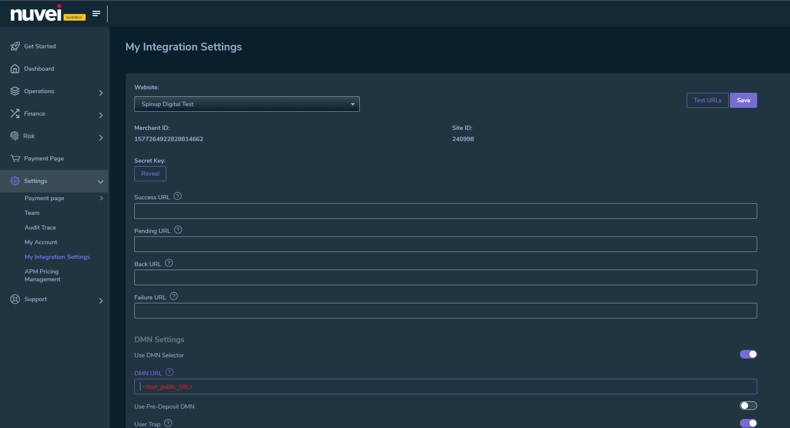

# Integration guide - DMN

- [Integration guide - DMN](#integration-guide---dmn)
  - [Step 1: Set up Nuvei Direct Merchant Notification](#step-1-set-up-nuvei-direct-merchant-notification)
  - [Step 2: Deploy the DMN module](#step-2-deploy-the-dmn-module)
  - [Step 3: Processing notifications](#step-3-processing-notifications)

The Direct Merchant Notification Module acts as a vital interface for handling asynchronous notifications from Nuvei. These notifications relay important updates regarding payment status updates, including authorizations, charges, or refunds. Upon receipt of a notification from Nuvei, the module diligently interacts with the commercetools platform, locating the relevant payment transaction and adjusting it accordingly to maintain coherence with Nuvei's updates.

The diagram below illustrates the integration flow of the DMN module, which operates on the [Nuvei Direct Merchant Notification](https://docs.nuvei.com/documentation/integration/webhooks/):


## Step 1: Set up Nuvei Direct Merchant Notification

You have to register the dmn module `public URL` in the Nuvei integration settings in order to receive notifications:



## Step 2: Deploy the DMN module
In order to make the DMN module up and running, follow our  [how to run guide](./HowToRun.md).

## Step 3: Processing notifications

Nuvei sends notifications which look like this:

```json
{
  "ppp_status": "OK",
  "Status": "APPROVED",
  "ExErrCode": 0,
  "ErrCode": 0,
  "errApmCode": 0,
  "errApmDescription": "",
  "errScCode": 0,
  "errScDescription": "",
  "Reason": "",
  "ReasonCode": 0,
  "PPP_TransactionID": "438407548",
  "userid": "PKdDe-kiZHWkzisfQwSv1p0G",
  "merchant_unique_id": "26cf63a7-b5a4-40d7-97a9-e15aaaf0f73e", // should match an existing payment key in commercetools
  "customData": "",
  "productId": "",
  "first_name": "",
  "last_name": "",
  "email": "user@gmail.com",
  "currency": "USD",
  "clientUniqueId": "26cf63a7-b5a4-40d7-97a9-e15aaaf0f73e",
  "customField1": "",
  "invoice_id": "",
  "address1": "",
  "address2": "",
  "country": "United States",
  "state": "",
  "city": "",
  "zip": "",
  "phone1": "",
  "phone2": "",
  "phone3": "",
  "client_ip": "78.130.161.238",
  "nameOnCard": "",
  "cardNumber": "",
  "bin": "",
  "noCVV": "",
  "acquirerId": "",
  "acquirerBank": "ApmEmulator-PI",
  "expMonth": "",
  "expYear": "",
  "Token": "",
  "tokenId": "",
  "AuthCode": "",
  "AvsCode": "",
  "Cvv2Reply": "",
  "shippingCountry": "",
  "shippingState": "",
  "shippingCity": "",
  "shippingAddress": "",
  "shippingZip": "",
  "shippingFirstName": "",
  "shippingLastName": "",
  "shippingPhone": "",
  "shippingCell": "",
  "shippingMail": "",
  "total_discount": "0.00",
  "total_handling": "0.00",
  "total_shipping": "0.00",
  "total_tax": "0.00",
  "buyButtonProductBundleId": "",
  "merchant_site_id": "240998",
  "merchant_status": "",
  "action": "",
  "requestVersion": "",
  "message": "APPROVED",
  "merchantLocale": "",
  "unknownParameters": "",
  "payment_method": "apmgw_ApmEmulator",
  "ID": "",
  "merchant_id": "1577264922828814662", // should match the NUVEI_MERCHANT_ID
  "responseTimeStamp": "2024-04-24.15:57:43",
  "buyButtonProductId": "",
  "webMasterId": "",
  "appliedPromotions": "",
  "uniqueCC": "",
  "transactionType": "Sale",
  "externalEmail": "",
  "cardCompany": "",
  "eci": "",
  "user_token_id": "PKdDe-kiZHWkzisfQwSv1p0G",
  "userPaymentOptionId": "",
  "TransactionID": "811000000004528013", // should match a transaction interactionId in commercetools
  "ExternalaccountID": "user@gmail.com",
  "APMReferenceID": "38FE34B5B3DEA2066DC534E9D8CCDBD6",
  "orderTransactionId": "1278607208",
  "totalAmount": "4676.40",
  "dynamicDescriptor": "test",
  "item_name_1": "NA",
  "item_number_1": "",
  "item_amount_1": "4676.40",
  "item_quantity_1": "1",
  "item_discount_1": "0.00",
  "item_handling_1": "0.00",
  "item_shipping_1": "0.00",
  "feeAmount": "",
  "amountWithoutFee": "",
  "houseNumber": "",
  "customCurrency": "",
  "type": "DEPOSIT",
  "clientRequestId": "5d823450-0253-11ef-8d53-7b279d52e3a2",
  "relatedTransactionId": "",
  "sessionId": "0d3b3b0f7cc352eda0decb9e6062",
  "responsechecksum": "d3b4b521c50ba03aac7c1e474a9876b1597d69ffae233888f01e6f06878b38f0",
  "advanceResponseChecksum": "18dbc77d494c0584c36de9981b27327322e8e9cb7d174114056142d80162818c"
}
```
