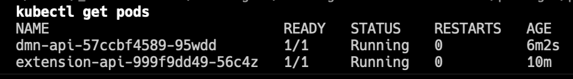
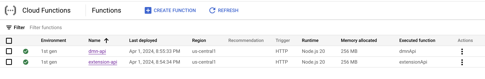

# Deployment

- [Deployment](#deployment)
  - [Docker](#docker)
    - [Using Docker Compose](#using-docker-compose)
      - [Building the images](#building-the-images)
      - [Running the Docker images](#running-the-docker-images)
  - [Kubernetes](#kubernetes)
    - [Minikube](#minikube)
  - [Google Cloud Functions - deploy via GitHub Actions](#google-cloud-functions---deploy-via-github-actions)

## Docker

When deploying the application using Docker, you can use the provided [`Dockerfile`](/Dockerfile) at the root of the repository to build an image and run a container.

### Using Docker Compose

The [`docker-compose.yml`](/docker-compose.yml) file can be used to run the application in a container.

#### Building the images

```bash
docker-compose build
```

#### Running the Docker images

```bash
docker-compose up
```

## Kubernetes

***Important Note!***: *The Helm charts are not production-ready and are intended for development and testing purposes only. This plugin takes no responsibility for ensuring your Helm charts are production-ready and secure - they need to be modified by your DevOps team in accordance with your organization's security and compliance policies.*

----------------

The Helm charts provided in the `k8s` directory can be used to deploy the application to a Kubernetes cluster.

```bash
cd k8s/helm/extension-api
helm package .
helm install extension-api extension-api-{chart-version}.tgz
```

### Minikube

After installing the Helm chart, you can use `kubectl` to check the status of the pods.

```bash
kubectl get pods
```

The output should look similar to the following:



## Google Cloud Functions - deploy via GitHub Actions

Below is as per [google-github-actions/auth@v2](https://github.com/google-github-actions/auth/tree/v2/?tab=readme-ov-file#preferred-direct-workload-identity-federation).
Refer for latest documentation and updates.

1. Create a Service Account and grant it the `Cloud Functions Developer` role.
2. Create a JSON key for the Service Account and save it as a GitHub secret.
3. Setup the `GCP_SERVICE_ACCOUNT_CREDENTIALS_JSON` secret in your repo, to be used with the `google-github-actions/auth@v2` action to authenticate with the Service Account.
4. Run the `deploy_gcp_cloud_functions.yml` workflow to deploy the function.
5. Setup the `GCP_PROJECT_ID` secret in your repo, to be used with the `google-github-actions/auth@v2` action to authenticate with the Service Account.
6. Setup the application credentials for each package in GitHub secrets/variables as seen in the `deploy_gcp_cloud_functions.yml` workflow. Make sure you've set the Authentication variables for the application to not expose your functions to the public without authentication.
7. Trigger the workflow to deploy the function.
8. After success, go to GCF and apply public permissions to the functions to enable public access.

The result should look similar to the following:




