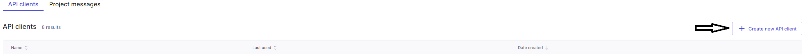
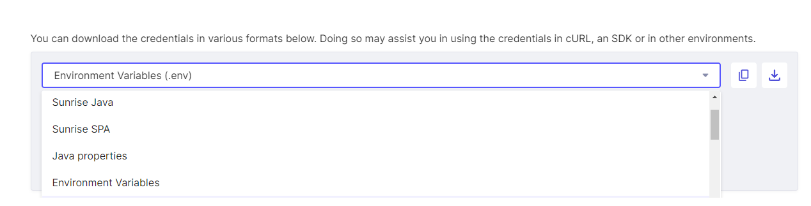

# How to run

- [How to run](#how-to-run)
  - [Environment variables](#environment-variables)
    - [Required environment variables](#required-environment-variables)
    - [Preparing the credentials](#preparing-the-credentials)
  - [Commercetools project requirements](#commercetools-project-requirements)
  - [Running](#running)
    - [Locally](#locally)
    - [Docker, Kubernetes, Google Cloud Functions](#docker-kubernetes-google-cloud-functions)

## Environment variables

The Extension API module requires the following variables to start:

```console
EXTENSION_API_PORT=

NUVEI_MERCHANT_ID=
NUVEI_MERCHANT_SITE_ID=
NUVEI_SECRET_KEY=
NUVEI_API_BASE_URL=
NUVEI_ENV=

CTP_PROJECT_KEY=
CTP_CLIENT_SECRET=
CTP_CLIENT_ID=
CTP_AUTH_URL=
CTP_API_URL=

CT_EXTENSION_AUTH_USER=
CT_EXTENSION_AUTH_PASSWORD=
```

There are 3 groups of environment variables as described below:

- `nuvei` attribute group
- `commercetools` attribute group
- `other` attribute group

### Required environment variables

| Group           | Name                         | Content                                                            |
| --------------- | ---------------------------- | ------------------------------------------------------------------ |
| `nuvei`         | `NUVEI_MERCHANT_ID`          | Identifies you as the merchant.                                    |
| `nuvei`         | `NUVEI_MERCHANT_SITE_ID`     | Identifies your site ID.                                           |
| `nuvei`         | `NUVEI_SECRET_KEY`           | This is the authentication component of the hash.                  |
| `nuvei`         | `NUVEI_API_BASE_URL`         | This is the nuvei base api url.                                    |
| `nuvei`         | `NUVEI_ENV`                  | Identifies your nuvei target environment.                          |
| `commercetools` | `CTP_PROJECT_KEY`            | The project key in commercetools                                   |
| `commercetools` | `CTP_CLIENT_SECRET`          | OAuth 2.0 `client_secret` and can be used to obtain a token.       |
| `commercetools` | `CTP_CLIENT_ID`              | OAuth 2.0 `client_id` and can be used to obtain a token.           |
| `commercetools` | `CTP_AUTH_URL`               | The commercetools OAuth 2.0 service is hosted at that URL.         |
| `commercetools` | `CTP_API_URL`                | The commercetools HTTP API is hosted at that URL.                  |
| `other`         | `CT_EXTENSION_AUTH_USER`     | This is the username used for the basic authentication.            |
| `other`         | `CT_EXTENSION_AUTH_PASSWORD` | This is the password used for the basic authentication.            |
| `other`         | `EXTENSION_API_PORT`         | The port number on which the application will run.                 |

> **_NOTE:_** The environment variables should be written as key-value pairs in a `.env` file. Have a look at the `.env.example` file in the root of the module for example.

### Preparing the credentials

- Nuvei credentials: You will need to reach Nuvei directly to grab the required credentials.
- commercetools project credentials:
    - If you don't have the commercetools OAuth credentials, [create a commercetools API Client](https://docs.commercetools.com/getting-started.html#create-an-api-client) or follow the next steps:
        1. To generate the CTP environments go to your commercetools merchant center.

        2. Open the `Developer settings`

            

        3. Click on `Create new API Client`

            

        4. On the `New API client` page, give your api key a name (in this example "nuvei-dev-settings) and add the permissions you wish this key to have access on:

            

        5. Once generated, you can export the key as env variables:

            

## Commercetools project requirements

Resources below are required for the api extension module to run correctly.

1. [The commercetools HTTP API Extension pointing to Nuvei extension api module](../../packages/extension-setup/src/resources/custom-extensions.json)
2. [Payment custom type](../../packages/extension-setup/src/resources/custom-types.json)

You will need to run the setup project which is part of this repository to attach the extension to the commercetools project. Please follow the [Extension Setup documentation](../../packages/extension-setup/docs/HowToRun.md) for details.

## Running

### Locally

From the repository root, run the following command:

```bash
yarn workspace @nuvei/extension-api start
```

Or you can run the following command from the `packages/extension-api` directory:

```bash
yarn start
```

### Docker, Kubernetes, Google Cloud Functions

Please refer to the [Deployment](/docs/deployment//Deployment.md) documentation for instructions on running on Docker, Kubernetes or Google Cloud Functions.
