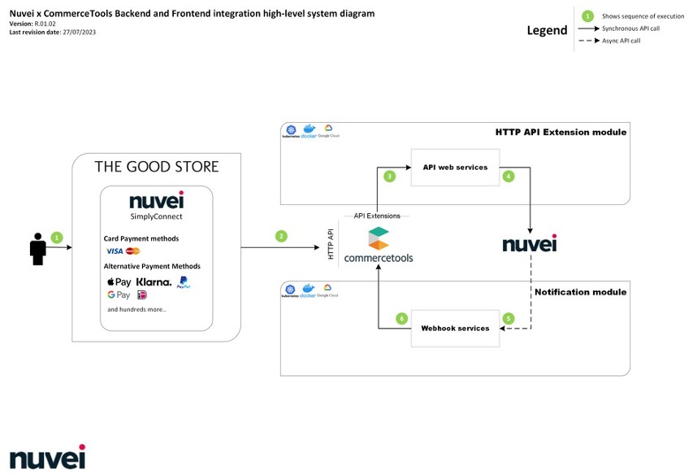

# Nuvei Commercetools Composable Commerce Plugin

`nuvei-commercetools` provides an Nuvei Simply Connect based integration between the commercetools and Nuvei PSP.

## Overview

This repository has 2 independent modules that to interact with commercetools and Nuvei. For full integration, it's essential to run both modules concurrently.

1. The front end lists all available payment options.

2. The user selects the Nuvei payment option which will create a payment with `paymentInterface = 'nuvei'` on purchase completion.

3. With the help of the [commercetools HTTP API Extensions](https://docs.commercetools.com/api/projects/api-extensions) provided data is sent to the Extension API Module.

4. The Extension API Module processes the provided payload passed by the front end and exchanges it with the Nuvei API for a session token and provides synchronous response back to the front end / commercetools caller. After receiving the response and using the
   session token the FE initializes the [Nuvei Simply Connect](https://docs.nuvei.com/documentation/accept-payment/simply-connect/) widget which presents the required payment methods.

Furthermore, the DMN module will receive from Nuvei asynchronous notifications for every payment status update. To seamlessly integrate your front end with both the Extension API and DMN modules, please refer to the comprehensive guides provided below.

## Extension API module

The extension api module serves as a publicly accessible intermediary service facilitating communication between the commercetools platform and Nuvei. Upon configuring [commercetools HTTP API Extensions](#https://docs.commercetools.com/api/projects/api-extensions) to invoke the
Nuvei extension api module, the commercetools platform will remotely trigger the Nuvei extension api module for each payment creation.

- Refer to the [Integration Guide](./extension-api/docs/IntegrationGuide.md) for instructions on integrating your shop with this module.
- Refer to the [How to run](./extension-api/docs/HowToRun.md) the extension module.

## DMN module

The Direct Merchant Notification Module acts as a vital interface for handling asynchronous notifications from Nuvei. These notifications relay important updates regarding payment status updates, including authorizations, charges, or refunds. Upon receipt of a notification from
Nuvei, the module diligently interacts with the commercetools platform, locating the relevant payment transaction and adjusting it accordingly to maintain coherence with Nuvei's updates.

- Refer to the [Integration Guide](./dmn-api/docs/IntegrationGuide.md) for information how to integrate with DMN module.
- Refer to the [How to run](./dmn-api/docs/HowToRun.md) the dmn module.

## Non-Functional features

- [x] **Security**: The extension-api module is secured with basic authentication.
- [x] **Logging**: The modules are integrated with the [Winston logger](https://github.com/winstonjs/winston) for logging. The logs are stored in the `logs` directory. You can add your own logger by extending the [LoggerInterface](/packages/util/src/logger/logger-interface.ts)
        interface.
- [x] **Unit tests**: The extension-api and dmn-api modules are integrated with [Vitest](https://vitest.dev/) for unit testing.
- [x] **Code standards**: The modules are integrated with [ESLint](https://eslint.org/) via [XO.js](https://github.com/xojs/xo) for code standardization checks via . The ESLint configuration is available in the root of the repository.
- [x] **Code formatting**: The modules are integrated with [Prettier](https://prettier.io/) for code formatting. The Prettier configuration is available in the root of the repository.
- [x] **Static Code Analysis**: The modules are integrated with [SonarCloud](https://sonarcloud.io/) for static code analysis. The SonarCloud configuration is available in the root of the repository.
- [x] **Security Scanning**: The modules are integrated with [Bearer](https://www.bearer.sh/) for security scanning.

## Disclaimers

- This module does not aim to modify or take an opinion on the payment flow of your business. It is designed to facilitate the integration between the commercetools platform and the Nuvei PSP. This is why this module is designed to be as flexible as possible and will not make
    modifications to your Order's status, payment status, or any other business logic.
- The deployment of the modules will depend on your organization's security and compliance policies. The provided Helm charts, Dockerfile, docker-compose.yaml should not be considered production-ready and should be reviewed by your organization's DevOps team before deployment.
